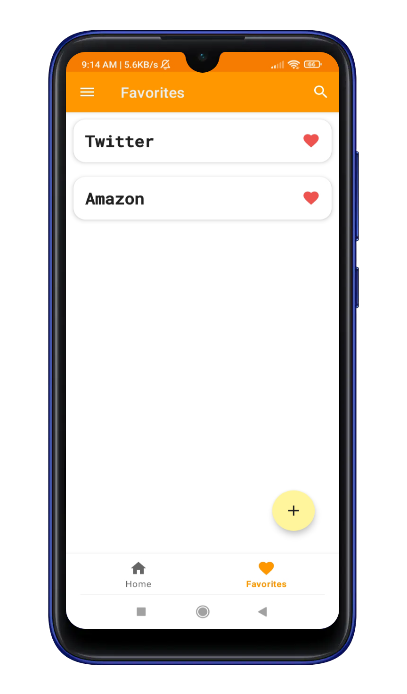

# About

Datavault is an Android app cloud-based password manager, offers users the convenience of
signing up via their Google account or through a custom account. Within the platform, users have
the power to effortlessly read, create, update, or delete password information documents.
Additionally, Datavault allows users to personalize their experience by updating their name and
profile picture. Datavault uses Firebase which is a set of backend cloud computing services and
application development platforms provided by Google. This app was originally completed in the
early 2023, the old repository was deleted and replaced due to possible data leak and security concern.

## Functions

- Authenticate with Google account
- Authenticate/register a custom account
- Create, read, update or delete password documents
- Add password documents to favorites list
- Update their profile name and picture

## Quick Preview

  
  
  
  

## Disclaimer

The purpose of this project is to learn native android app development as well as integrating
cloud technologies. Please do not use this app to store highly sensitive information unless you
know what you are doing.
